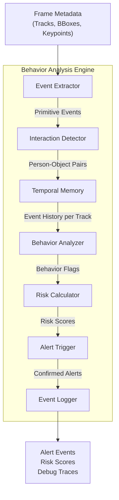
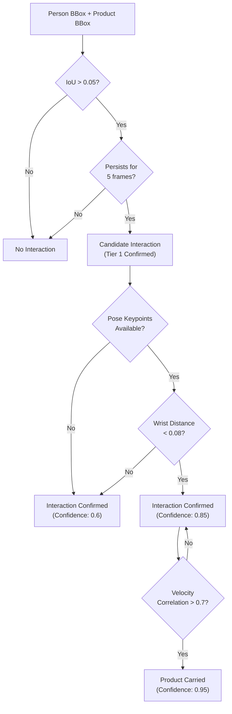
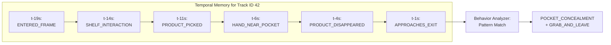
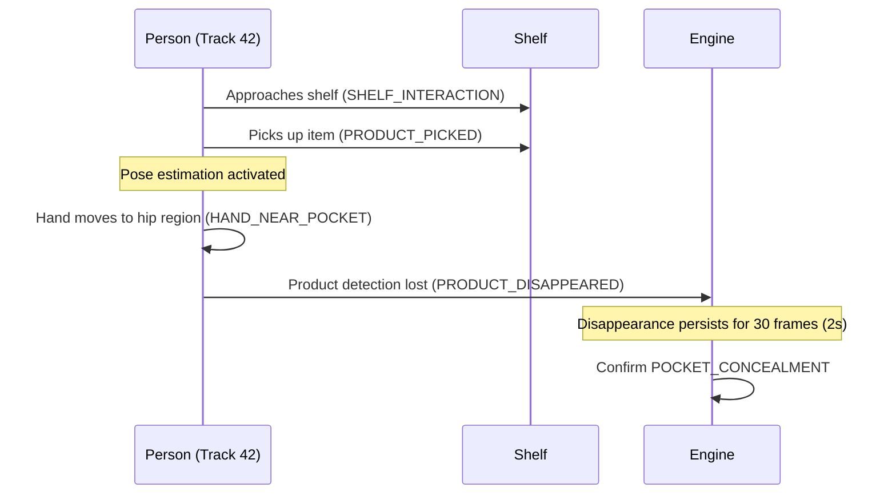
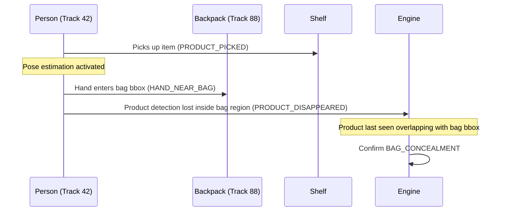
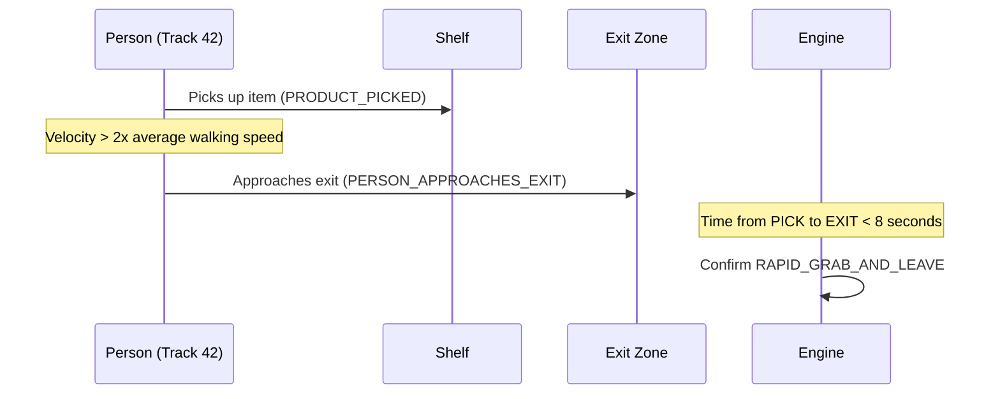
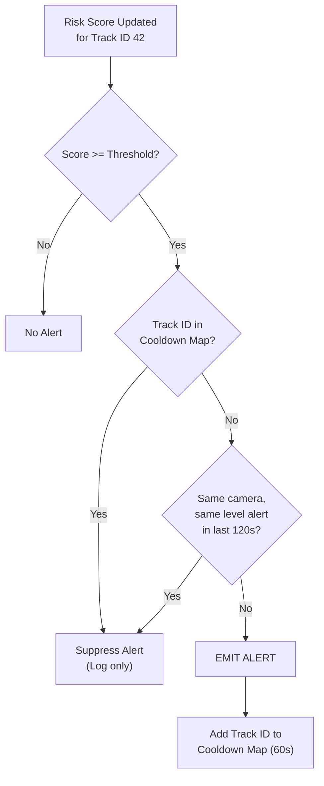
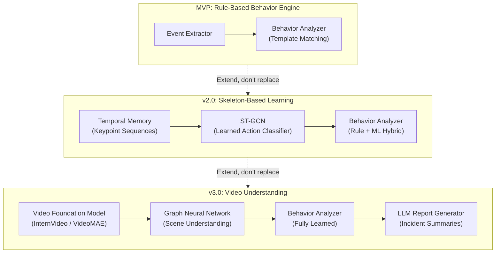
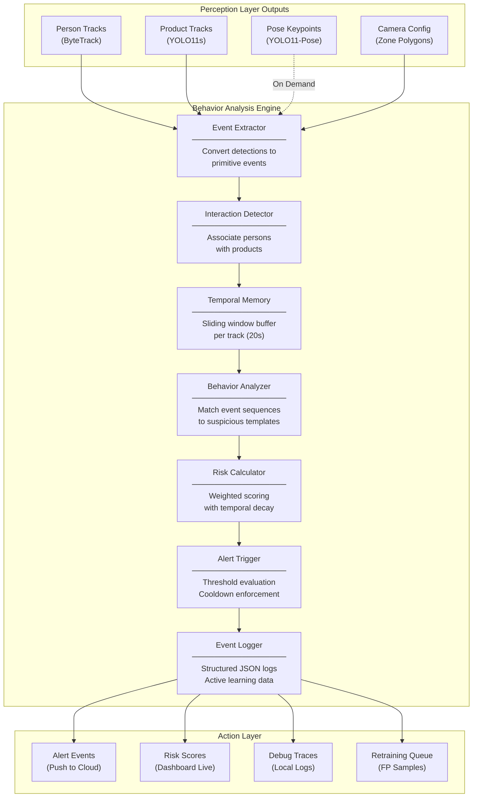

# Behavior Analysis Engine — Architecture Design Document

**Document Type**: Internal Engineering Design Review  
**Classification**: Implementation Blueprint  
**Audience**: Engineering Team, Technical Leads  

---

## 1. Purpose

### 1.1 Responsibilities
The Behavior Analysis Engine is the decision-making core of the Retail AI Surveillance Platform. It sits between the perception layer (detection, tracking, pose estimation) and the action layer (alerts, evidence clips, dashboard). Its responsibilities are:

1. **Interpret structured perception data** — Transform raw bounding boxes, tracking IDs, and keypoints into semantic events ("person picked up item", "hand moved toward pocket").
2. **Maintain temporal context** — Accumulate event history per tracked individual across a sliding time window to reason about action sequences.
3. **Detect suspicious behavioral patterns** — Match observed event sequences against predefined suspicious behavior templates (concealment, loitering, intrusion).
4. **Calculate continuous risk scores** — Produce a real-time, per-person numerical risk score rather than binary decisions, enabling graduated alert levels.
5. **Trigger verified alerts** — Emit alert events only after multi-stage verification (temporal persistence, confidence thresholds, cooldown checks).

### 1.2 Boundary Definition
The Behavior Engine does **not**:
- Run neural network inference (that is the pipeline's responsibility).
- Decode video frames or manage camera streams.
- Store evidence clips or manage cloud uploads.
- Render dashboards or dispatch push notifications.

It is a pure logic layer: deterministic, stateless across restarts (state is reconstructable from active tracks), and independently testable.

### 1.3 Input-Output Contract

```text
                    ┌─────────────────────────────────┐
                    │      Behavior Analysis Engine    │
                    │                                  │
  Frame Metadata ──>│  Event Extractor                 │
  Person Tracks  ──>│  Interaction Detector            │──> Alert Events
  Product Tracks ──>│  Temporal Memory                 │──> Risk Scores
  Pose Keypoints ──>│  Behavior Analyzer               │──> Event Logs
  Camera Config  ──>│  Risk Calculator                 │──> Debug Traces
                    │  Alert Trigger                   │
                    └─────────────────────────────────┘
```

---

## 2. Inputs

Every input to the Behavior Engine arrives as a structured metadata object attached to a processed video frame. No raw pixel data enters the engine.

### 2.1 Input Catalog

| Input | Data Type | Source | Why It Is Needed |
| :--- | :--- | :--- | :--- |
| **Person Tracks** | List of `{track_id, bbox, confidence, velocity, age_frames}` | ByteTrack | Identify and follow individuals across frames. `age_frames` indicates how long this track has been alive. |
| **Product Tracks** | List of `{track_id, bbox, class_label, confidence}` | YOLO11s + ByteTrack | Track retail items to detect pick-up, return, and disappearance events. |
| **Bounding Boxes** | `[x_min, y_min, x_max, y_max]` normalized to $[0, 1]$ | YOLO11s | Spatial coordinates for computing intersections, distances, and containment checks. |
| **Track IDs** | Integer per tracked object | ByteTrack | Maintain identity continuity. A single track ID represents one physical entity across all frames in which it is visible. |
| **Timestamps** | `float` epoch milliseconds per frame | Ingestion Layer | Measure durations (loitering time), compute velocities, and enforce temporal thresholds. |
| **Camera Metadata** | `{camera_id, fps, resolution, zone_polygons[], restricted_polygons[]}` | Edge Config DB | Map pixel coordinates to semantic zones. Different cameras may have different sensitivity thresholds. |
| **Pose Keypoints** (Optional) | 17-point COCO skeleton: `{joint_id: (x, y, confidence)}` | YOLO11-Pose Nano | Required only when a person enters the `INTERACTING` state. Provides wrist, hip, shoulder, and head joint positions for gesture analysis. |
| **Detection Confidence** | `float [0.0, 1.0]` per bounding box | YOLO11s | Filter low-confidence phantom detections that cause false events. Detections below $0.25$ are discarded before they reach the engine. |

### 2.2 Architectural Decision: Late Pose Activation

Pose estimation is computationally expensive. Running it on every person in every frame wastes GPU cycles on customers who are simply walking through the store. Instead, YOLO11-Pose is activated **on demand** — only when the Interaction Detector determines that a person's bounding box overlaps with a product or enters a high-shrink zone. This reduces GPU load by approximately 60-70% compared to always-on pose estimation.

**Trade-off**: If a shoplifter grabs and conceals an item in a single rapid motion before the engine activates pose estimation, the system may miss the initial grab frame. We mitigate this by maintaining a 1-second retroactive frame buffer — when pose estimation activates, the pipeline retroactively runs pose on the buffered past 15 frames to reconstruct the grab trajectory.

---

## 3. Internal Modules

The engine is decomposed into seven independent, sequentially executed modules. Each module has a single responsibility and communicates through well-defined data structures.



### Module 1: Event Extractor
* **Responsibility**: Convert raw per-frame detection and tracking data into discrete primitive events.
* **Examples**: `PERSON_ENTERED_FRAME`, `PRODUCT_PICKED`, `PERSON_CROUCHED`.
* **Execution**: Runs on every frame. Compares current frame state against previous frame state to detect transitions.
* **Output**: A list of `PrimitiveEvent(event_type, track_id, timestamp, bbox, confidence)` objects.

### Module 2: Interaction Detector
* **Responsibility**: Determine which person is interacting with which product. Establish person-object association pairs.
* **Output**: A list of `Interaction(person_track_id, object_track_id, interaction_type, start_time)` objects.
* **Detail**: See Section 4.

### Module 3: Temporal Memory
* **Responsibility**: Maintain a per-track sliding window buffer of recent events and interactions.
* **Data Structure**: A dictionary keyed by `track_id`, where each value is a time-ordered deque of events with a maximum window of 300 frames (20 seconds at 15 FPS).
* **Expiry**: Events older than the window are evicted. If a track is lost (person exits the frame), the memory entry is retained for 90 frames (6 seconds) to handle brief occlusions, then purged.

### Module 4: Behavior Analyzer
* **Responsibility**: Pattern-match the event history in the Temporal Memory against predefined suspicious behavior templates.
* **Output**: A list of `BehaviorFlag(behavior_type, track_id, confidence, evidence_events[])`.
* **Detail**: See Section 7.

### Module 5: Risk Calculator
* **Responsibility**: Aggregate behavior flags and primitive events into a single numerical risk score per person.
* **Output**: Updated `risk_score: float [0, 100]` for each active track.
* **Detail**: See Section 8.

### Module 6: Alert Trigger
* **Responsibility**: Evaluate risk scores against tiered thresholds to determine whether to emit an alert. Enforce cooldown locks to prevent duplicate alerts.
* **Output**: `AlertEvent(alert_level, track_id, camera_id, timestamp, evidence_clip_request)` or `None`.
* **Detail**: See Section 9.

### Module 7: Event Logger
* **Responsibility**: Persist every primitive event, behavior flag, risk score update, and alert decision to a structured log for debugging, auditing, and active learning.
* **Output**: Structured JSON log entries written to local disk and periodically synced to the cloud.

---

## 4. Person-Object Association

### 4.1 The Problem
The AI pipeline produces two independent streams of tracked objects: persons and products. There is no built-in semantic link between them. The engine must infer which person is interacting with which product.

### 4.2 Candidate Approaches

| Approach | Mechanism | Accuracy | Compute Cost | MVP Suitability |
| :--- | :--- | :--- | :--- | :--- |
| **Centroid Distance** | Euclidean distance between person bbox center and product bbox center. | Low (fails when person is near but facing away). | Very Low | Baseline fallback. |
| **Bounding Box Intersection (IoU)** | Check if the product bbox overlaps with the person bbox. | Medium (robust for close proximity). | Very Low | **Selected for MVP.** |
| **Hand Proximity** | Euclidean distance between wrist keypoint and product bbox center. | High (directly models "reaching for item"). | Medium (requires pose). | Used when pose is active. |
| **Movement Correlation** | Track velocity vectors of person and product; if they move together, they are associated. | High (excellent for "carrying" detection). | Low | Secondary signal. |
| **Temporal Consistency** | Require association to persist for $N$ consecutive frames before confirming. | Very High (eliminates single-frame noise). | Very Low | Applied as a filter on top of any approach. |

### 4.3 MVP Strategy: Layered Association

We use a two-tier strategy:

**Tier 1 (Always Active — No Pose Required)**:
1. Compute the IoU between every person bbox and every product bbox.
2. If $\text{IoU}(B_{person}, B_{product}) > 0.05$, flag as a candidate interaction.
3. Require the candidate to persist for 5 consecutive frames ($\approx 333\text{ms}$ at 15 FPS) to confirm.

**Tier 2 (Activated When Pose Is Available)**:
1. If a person has active keypoints, compute the Euclidean distance between the nearest wrist keypoint and the product bbox center.
2. If $d_{wrist \to product} < 0.08$ (normalized coordinates), upgrade the interaction confidence.
3. Additionally, check movement correlation: if the product bbox velocity vector aligns with the person's velocity vector (cosine similarity > 0.7) for 10+ frames, mark the product as "carried by" the person.

**Trade-off**: IoU-based association is simple and CPU-only, but it can falsely associate products on nearby shelves with passing customers. The 5-frame persistence filter mitigates this — a person must linger near the product, not simply walk past it.



---

## 5. Event Detection — Primitive Events Catalog

Primitive events are atomic, single-frame or short-duration observations. They are the building blocks from which complex suspicious behaviors are composed.

### 5.1 Person Lifecycle Events

#### `PERSON_ENTERED_FRAME`
* **Trigger**: A new `track_id` appears for the first time in the tracker output.
* **Required Inputs**: Person track with `age_frames == 1`.
* **Output**: `PrimitiveEvent(PERSON_ENTERED_FRAME, track_id, timestamp, entry_bbox)`.
* **Confidence**: Equals the detection confidence of the first bbox ($\geq 0.25$).

#### `PERSON_LEFT_FRAME`
* **Trigger**: An active `track_id` disappears from the tracker output for $> 90$ consecutive frames (6 seconds).
* **Required Inputs**: Temporal Memory entry showing the last known position and timestamp.
* **Output**: `PrimitiveEvent(PERSON_LEFT_FRAME, track_id, last_timestamp, last_bbox)`.
* **Confidence**: 1.0 (deterministic event based on absence).

#### `PERSON_APPROACHES_EXIT`
* **Trigger**: A person's bottom-center coordinate enters a predefined exit zone polygon AND their velocity vector points toward the exit.
* **Required Inputs**: Person track centroid, velocity vector, camera `exit_zone_polygon`.
* **Output**: `PrimitiveEvent(PERSON_APPROACHES_EXIT, track_id, timestamp, distance_to_exit)`.
* **Confidence**: Based on velocity direction alignment with exit vector.

#### `PERSON_ENTERS_RESTRICTED_AREA`
* **Trigger**: A person's bottom-center coordinate enters a restricted zone polygon defined in camera configuration.
* **Required Inputs**: Person track centroid, camera `restricted_polygons[]`.
* **Output**: `PrimitiveEvent(PERSON_ENTERS_RESTRICTED_AREA, track_id, timestamp, zone_id)`.
* **Confidence**: 1.0 (geometric containment check is deterministic).

#### `PERSON_STATIONARY`
* **Trigger**: A person's centroid displacement over the last 45 frames (3 seconds) is below a velocity threshold $v_{min} = 0.005$ normalized units per frame.
* **Required Inputs**: Person track centroid history (Temporal Memory).
* **Output**: `PrimitiveEvent(PERSON_STATIONARY, track_id, timestamp, duration_seconds)`.
* **Confidence**: Proportional to duration: $\min(1.0, \text{duration} / \theta_{loiter})$.

### 5.2 Product Interaction Events

#### `PRODUCT_PICKED`
* **Trigger**: A confirmed Tier-1 or Tier-2 person-object interaction begins. The product bbox was stationary on the shelf region and is now moving or overlapping with the person.
* **Required Inputs**: Product track, person track, IoU history.
* **Output**: `PrimitiveEvent(PRODUCT_PICKED, person_track_id, product_track_id, timestamp)`.
* **Confidence**: Tier-1: 0.6. Tier-2 (with wrist proximity): 0.85.

#### `PRODUCT_RETURNED`
* **Trigger**: A product that was associated with a person re-enters the shelf region bbox AND the person-object IoU drops to zero for 10+ frames.
* **Required Inputs**: Product track, shelf zone polygon, person-object association history.
* **Output**: `PrimitiveEvent(PRODUCT_RETURNED, person_track_id, product_track_id, timestamp)`.
* **Confidence**: 0.8.

#### `PRODUCT_DISAPPEARED`
* **Trigger**: A product that was associated with a person loses its tracking (detection confidence drops below 0.20) while the person remains visible.
* **Required Inputs**: Product track confidence history, active person-object association.
* **Output**: `PrimitiveEvent(PRODUCT_DISAPPEARED, person_track_id, product_track_id, timestamp, last_known_bbox)`.
* **Confidence**: 0.7 (product may simply be occluded by the person's body, which is expected during carrying).
* **Note**: This event alone is not suspicious. It becomes suspicious only in combination with concealment gestures (Section 7).

### 5.3 Pose-Dependent Events (Activated On Demand)

#### `HAND_NEAR_POCKET`
* **Trigger**: The Euclidean distance between a wrist keypoint and the corresponding hip keypoint drops below $\theta_{pocket} = 0.12 \times \text{person\_height}$.
* **Required Inputs**: Pose keypoints (wrist, hip), person bbox height.
* **Output**: `PrimitiveEvent(HAND_NEAR_POCKET, track_id, timestamp, side, distance)`.
* **Confidence**: Inversely proportional to distance: $1.0 - (d / \theta_{pocket})$.

#### `HAND_NEAR_BAG`
* **Trigger**: A wrist keypoint enters the bounding box of an associated backpack or handbag.
* **Required Inputs**: Pose keypoints (wrist), bag bbox.
* **Output**: `PrimitiveEvent(HAND_NEAR_BAG, track_id, timestamp, bag_track_id)`.
* **Confidence**: Based on wrist-to-bag-center distance.

#### `PERSON_BENDS_OR_CROUCHES`
* **Trigger**: The ratio of the person's bbox height to their historical median height drops below 0.65, indicating a crouching or bending posture.
* **Required Inputs**: Person bbox height, historical median height from Temporal Memory.
* **Output**: `PrimitiveEvent(PERSON_CROUCHES, track_id, timestamp, height_ratio)`.
* **Confidence**: $1.0 - \text{height\_ratio}$.

#### `SHELF_INTERACTION`
* **Trigger**: A person's wrist keypoint enters a shelf zone polygon AND the person is facing the shelf (estimated from shoulder orientation).
* **Required Inputs**: Pose keypoints (wrists, shoulders), shelf zone polygons.
* **Output**: `PrimitiveEvent(SHELF_INTERACTION, track_id, timestamp, shelf_zone_id)`.
* **Confidence**: 0.75.

#### `BACKPACK_OPENED` (Future Enhancement)
* **Trigger**: The aspect ratio of a tracked backpack changes significantly (width increases relative to height), indicating the bag is being opened.
* **Required Inputs**: Backpack bbox aspect ratio history.
* **Note**: Requires fine-grained backpack detection model in v2.0.

---

## 6. Temporal Reasoning

### 6.1 Why Single-Frame Decisions Are Unreliable
A single video frame is a snapshot with no causal context. Consider: a customer reaches into their pocket to retrieve their phone. In that specific frame, their wrist keypoint is near their hip, and a product was near their hand 2 seconds ago. A frame-level classifier would flag this as concealment. Without temporal reasoning, the system cannot distinguish between "put phone in pocket" and "put stolen item in pocket."

### 6.2 Sliding Window Architecture
The Temporal Memory maintains a per-track sliding window of the last $W = 300$ frames (20 seconds at 15 FPS). Every primitive event generated by the Event Extractor is appended to the corresponding track's event deque.



### 6.3 Event History and Decay
* **Event TTL (Time-To-Live)**: Each event in the Temporal Memory has a TTL of 20 seconds. After 20 seconds, the event is evicted regardless of whether it was consumed by a behavior template.
* **Score Decay**: Risk scores associated with events decay linearly. An event that contributed +30 points to the risk score 15 seconds ago contributes only $30 \times (1 - 15/20) = 7.5$ points now. This ensures that a person who picked up an item 20 seconds ago and is now calmly shopping does not remain at high risk forever.
* **Track Expiry**: If a track ID disappears (person leaves the frame), the Temporal Memory retains the entry for 90 frames (6 seconds). If the same track reappears (ByteTrack re-associates it after a brief occlusion), the event history is preserved. After 6 seconds, the entry is purged.

### 6.4 Causal Ordering
The Behavior Analyzer requires events to occur in a specific temporal order. The sequence `PRODUCT_PICKED → HAND_NEAR_POCKET → PRODUCT_DISAPPEARED` is suspicious. The reverse sequence `PRODUCT_DISAPPEARED → HAND_NEAR_POCKET → PRODUCT_PICKED` is nonsensical and is discarded. The engine enforces strict causal ordering when matching behavior templates.

---

## 7. Suspicious Behavior Detection

Each suspicious behavior is defined as a temporal sequence template. The Behavior Analyzer scans each track's event history for matching subsequences.

### 7.1 Pocket Concealment

* **Description**: A person picks up a product from a shelf and moves it into their jacket or pants pocket. The product disappears from camera view while the person's hand is near their hip/pocket region.



* **Required Event Sequence** (within 15-second window):
  1. `PRODUCT_PICKED` (person $P_i$ picks product $O_j$)
  2. `HAND_NEAR_POCKET` (same person $P_i$, same side hand)
  3. `PRODUCT_DISAPPEARED` (product $O_j$ loses detection for $\geq 30$ frames)
* **Confidence Calculation**:
  $$C_{pocket} = C_{pick} \times C_{hand} \times C_{disappear} \times T_{decay}$$
  Where $T_{decay} = \max(0.5, 1.0 - \Delta t / 15.0)$ and $\Delta t$ is the time span of the full sequence in seconds.
* **False Positive Risks**: Customer reaching for their phone, wallet, or keys while near a shelf. Customer placing their own purchased item from another store into their pocket.
* **Mitigation**:
  - Require the `PRODUCT_PICKED` event to precede `HAND_NEAR_POCKET`. Without a confirmed pick, pocket proximity alone does not trigger this behavior.
  - Apply a 30-frame (2-second) persistence filter on `PRODUCT_DISAPPEARED`. If the product reappears within 2 seconds (customer was inspecting it), the behavior flag is cancelled.

---

### 7.2 Bag Concealment

* **Description**: A person transfers a product directly into their personal backpack, purse, or reusable tote bag.



* **Required Event Sequence** (within 15-second window):
  1. `PRODUCT_PICKED`
  2. `HAND_NEAR_BAG` (wrist keypoint enters bag bbox)
  3. `PRODUCT_DISAPPEARED` (product $O_j$ last known bbox overlaps $> 0.5$ IoU with bag bbox)
* **Confidence Calculation**:
  $$C_{bag} = C_{pick} \times C_{hand\_bag} \times \text{IoU}(B_{item\_last}, B_{bag}) \times T_{decay}$$
* **False Positive Risks**: Customer placing their own personal item (phone, keys) into their bag. Customer using a reusable shopping bag provided by the store.
* **Mitigation**:
  - Exclude bags that have been associated with the person since frame 1 (they entered the store carrying it) only if the bag's aspect ratio and position remain unchanged. If the bag is being actively opened (aspect ratio change), maintain suspicion.
  - Cross-reference with store-provided basket/cart detection: if the person already has a store basket, bag concealment confidence is reduced by 30%.

---

### 7.3 Loitering in High-Shrink Zones

* **Description**: A person remains stationary or moves minimally within a defined high-value zone (cosmetics, alcohol, electronics) for an extended period without picking up items.

* **Required Events**:
  1. `PERSON_ENTERED_FRAME` (person enters zone polygon)
  2. `PERSON_STATIONARY` (duration exceeds $\theta_{loiter}$, default: 120 seconds)
  3. No `PRODUCT_PICKED` events during the stationary period
* **Confidence Calculation**:
  $$C_{loiter} = \min\left(1.0, \frac{\text{duration}_{stationary}}{\theta_{loiter}} \right) \times Z_{weight}$$
  Where $Z_{weight}$ is a zone-specific multiplier (e.g., alcohol aisle: 1.2, cosmetics: 1.3, general: 0.8).
* **False Positive Risks**: Employee stocking shelves. Customer reading product labels.
* **Mitigation**: Alert level is `LOW` (informational). The system recommends "proactive customer service" rather than suspicion — an associate approaches and says "Can I help you find something?"

---

### 7.4 Restricted Area Intrusion

* **Description**: A person enters an employee-only zone (stockroom door, cash office, behind the counter).

* **Required Events**:
  1. `PERSON_ENTERS_RESTRICTED_AREA` (person centroid inside restricted polygon)
* **Confidence Calculation**: $C_{intrusion} = 1.0$ (geometric containment is deterministic).
* **Alert Level**: `CRITICAL` (immediate). No temporal accumulation required.
* **False Positive Risks**: Employee entering legitimately.
* **Mitigation**: If employee detection is configured (e.g., high-visibility vest detection), suppress the alert. Otherwise, dispatch immediately — the store manager can dismiss it with a single tap.

---

### 7.5 Rapid Grab-and-Leave

* **Description**: A person quickly grabs a product and moves directly toward the exit at elevated speed, suggesting a smash-and-grab theft.



* **Required Event Sequence** (within 8-second window):
  1. `PRODUCT_PICKED`
  2. `PERSON_APPROACHES_EXIT` (within 8 seconds of pick event)
  3. Person velocity $> 2.0 \times v_{avg}$ (where $v_{avg}$ is the camera's historical average walking speed)
* **Confidence Calculation**:
  $$C_{grab} = C_{pick} \times \frac{v_{person}}{v_{avg}} \times \left(1 - \frac{\Delta t_{pick \to exit}}{8.0}\right)$$
* **Alert Level**: `HIGH` or `CRITICAL` depending on velocity.
* **False Positive Risks**: Customer who already paid at a different register and is walking quickly to the exit with a purchased item.
* **Mitigation**: If POS integration is available (future), cross-reference the product ID with recent transactions. For MVP, dispatch the alert with the evidence clip and let the associate decide.

---

### 7.6 Suspicious Repeated Shelf Interaction

* **Description**: A person repeatedly picks up and returns items on the same shelf section, potentially comparing items for later concealment or causing distraction.

* **Required Events**: 3+ `SHELF_INTERACTION` events on the same `shelf_zone_id` within 120 seconds, combined with 2+ `PRODUCT_PICKED` / `PRODUCT_RETURNED` cycles.
* **Confidence Calculation**:
  $$C_{repeat} = \min\left(1.0, \frac{\text{interaction\_count}}{5}\right) \times 0.7$$
* **Alert Level**: `LOW` (informational / monitoring only).
* **False Positive Risks**: Customer genuinely comparing products (very common).
* **Mitigation**: This behavior alone never escalates above `LOW`. It is used as a contributing risk signal that boosts the overall risk score by a small amount (+5 to +10 points), making the system more sensitive to subsequent suspicious events from the same person.

---

## 8. Risk Scoring

### 8.1 Why Weighted Scoring Over Binary Decisions
Binary classification ("theft" vs. "not theft") forces premature, irreversible decisions. A weighted risk score enables:
- **Graduated responses**: A person at risk 30 gets a discreet "offer customer service" alert. A person at risk 85 gets an urgent "potential theft in progress" alert.
- **Composability**: Multiple weak signals (loitering + shelf interaction + pocket proximity) can accumulate into a strong composite signal, even if no single event is individually alarming.
- **Tunability**: Store managers can adjust alert thresholds without retraining models or modifying code.

### 8.2 Event Score Table

| Event | Base Score | Category | Rationale |
| :--- | :--- | :--- | :--- |
| `SHELF_INTERACTION` | +5 | Normal | Baseline signal; everyone interacts with shelves. |
| `PRODUCT_PICKED` | +10 | Normal | Expected shopping behavior; minor risk increment. |
| `PRODUCT_RETURNED` | -8 | Mitigating | Returning a product reduces suspicion. |
| `PERSON_STATIONARY` (>60s) | +8 | Attention | Mild loitering signal. |
| `PERSON_STATIONARY` (>120s) | +15 | Suspicious | Extended presence without shopping activity. |
| `HAND_NEAR_POCKET` | +20 | Suspicious | Active concealment gesture. |
| `HAND_NEAR_BAG` | +20 | Suspicious | Active concealment gesture. |
| `PRODUCT_DISAPPEARED` | +35 | High Risk | Product lost from detection while person has it. |
| `PERSON_APPROACHES_EXIT` | +20 | Context | Escalator — only dangerous combined with other flags. |
| `PERSON_CROUCHES` | +8 | Attention | Could indicate hiding behavior or simply tying shoes. |
| `PERSON_ENTERS_RESTRICTED_AREA` | +50 | Critical | Immediate unauthorized access. |
| High velocity (running) | +15 | Context | Unusual in-store movement. |
| Face consistently hidden/averted | +10 | Context | Possible intent to avoid identification. |

### 8.3 Score Calculation

The total risk score for a person $P_i$ at time $t$ is:
$$R_i(t) = \sum_{e \in \text{events}(P_i)} S_e \times D_e(t)$$

Where $S_e$ is the base score of event $e$, and $D_e(t)$ is the temporal decay factor:
$$D_e(t) = \max\left(0, 1 - \frac{t - t_e}{W}\right)$$

Where $W = 20$ seconds (the Temporal Memory window) and $t_e$ is the timestamp of event $e$.

### 8.4 Score Decay Over Time

```text
Score Contribution
     │
  S  │████
     │████████
     │████████████
     │████████████████
     │████████████████████
     └──────────────────────── Time
     t_event              t_event + 20s
```

An event that scored +35 at the moment it occurred contributes:
- +35 at $t_e$ (just happened)
- +26.25 at $t_e + 5s$ (75% of original)
- +17.5 at $t_e + 10s$ (50% of original)
- +8.75 at $t_e + 15s$ (25% of original)
- +0 at $t_e + 20s$ (expired)

### 8.5 Score Reset Conditions
The risk score for a track is reset to 0 when:
1. **Track terminated**: The person exits the frame and the Temporal Memory entry expires.
2. **Product returned**: A `PRODUCT_RETURNED` event for a previously picked product subtracts the accumulated concealment-related scores for that product.
3. **Alert acknowledged as False Positive**: If a store associate explicitly marks an alert as FP, the risk score for that track is capped at 20 for the remainder of the session to prevent re-triggering.

---

## 9. Alert Logic

### 9.1 Alert Levels & Thresholds

| Alert Level | Risk Score Range | Response | Notification Channel |
| :--- | :--- | :--- | :--- |
| **LOW** | 25 – 44 | Log only. No push notification. Available on dashboard for review. | Dashboard event log. |
| **MEDIUM** | 45 – 64 | "Proactive customer service" suggestion. Associate receives a gentle notification. | Dashboard + Mobile (silent notification). |
| **HIGH** | 65 – 84 | "Suspected theft in progress." Associate receives a vibrating alert with evidence clip. | Dashboard + Mobile (push notification with clip). |
| **CRITICAL** | 85 – 100 | "Immediate intervention required." All on-duty associates alerted. | Dashboard + Mobile (urgent push) + Audible chime on dashboard. |

### 9.2 Alert Suppression & Duplicate Prevention



* **Per-Track Cooldown**: After an alert is emitted for track ID $k$, the track enters a 60-second cooldown. Additional threshold crossings during cooldown are logged but do not generate new push notifications.
* **Per-Camera Rate Limiting**: A single camera cannot emit more than 3 alerts within a 5-minute window. If exceeded, subsequent alerts are queued and delivered as a batch summary ("Camera 3: 5 events in the last 10 minutes"). This prevents alert fatigue in high-traffic scenarios.
* **Escalation Override**: If a track's risk score jumps by more than 30 points in a single frame (e.g., a `PRODUCT_DISAPPEARED` event during active `HAND_NEAR_POCKET`), the cooldown is overridden and a new alert is emitted immediately.

### 9.3 Human Confirmation Workflow

1. Associate receives the alert notification on their mobile device.
2. Associate taps the notification to view the 3-second looping evidence clip.
3. Associate selects one of three options:
   - **"Confirmed — Theft occurred"**: The event is logged as a True Positive. The evidence clip is permanently archived.
   - **"Confirmed — Theft prevented"**: The event is logged as a True Positive with intervention. The associate approached the customer, who abandoned the concealed item.
   - **"False Alarm"**: The event is logged as a False Positive. The coordinate trajectories are queued for retraining data curation.
4. If no response is received within 120 seconds, the alert auto-classifies as "Unreviewed" and remains in the dashboard for end-of-shift review.

---

## 10. Failure Cases and Mitigations

| Failure Case | Impact | Mitigation Strategy |
| :--- | :--- | :--- |
| **Occlusion** (person hidden behind shelf or pillar) | Tracking ID may be lost; event history is interrupted. | ByteTrack Kalman prediction maintains the track for up to 90 frames. Temporal Memory retains events for 6 seconds after track loss. |
| **Crowded Scenes** (overlapping bounding boxes) | False person-object associations; incorrect tracking IDs. | Require 5-frame temporal persistence for all associations. Apply camera-specific maximum occupancy thresholds — disable concealment detection when >15 people are in frame (too noisy). |
| **False Detections** (phantom bounding boxes from reflections, shadows, or signage) | Spurious primitive events pollute the event history. | Filter detections below confidence 0.25. Require temporal persistence: a product must be detected for 3+ consecutive frames before it enters the tracking system. |
| **Camera Shake / Vibration** | All bounding boxes shift simultaneously, triggering false velocity and zone-crossing events. | Detect global frame-level motion (average displacement of all tracked boxes). If global motion exceeds a threshold, suppress zone-crossing and velocity-based events for that frame. |
| **Motion Blur** (fast hand movements during concealment) | Pose keypoints become inaccurate; wrist coordinates jitter. | Apply a 3-frame moving average filter on keypoint coordinates before distance calculations. Accept that detection of extremely fast concealment (<0.5 seconds) will have lower confidence. |
| **Lighting Changes** (fluorescent flicker, sunlight transitions) | Detection confidence drops temporarily, causing phantom `PRODUCT_DISAPPEARED` events. | Apply a "confidence recovery window" — if a product disappears but its detection confidence was declining gradually over 5+ frames (not a sudden drop), mark the disappearance as "lighting-induced" and suppress the event for 45 frames (3 seconds). |
| **Missing Detections** (YOLO fails to detect a product) | `PRODUCT_PICKED` event is never generated, breaking the behavior sequence. | The system cannot detect what it cannot see. This is a model accuracy limitation. Mitigation: continuously fine-tune YOLO on store-specific products via the active learning pipeline. |
| **Tracking ID Switches** (ByteTrack assigns a new ID after occlusion) | Event history is split across two track IDs, preventing behavior pattern matching. | Extend ByteTrack's `max_time_lost` parameter to 90 frames. For future versions, integrate a lightweight appearance-based Re-ID module. |

---

## 11. Future Improvements — Extension Points

The Behavior Engine is designed with explicit extension hooks to integrate advanced AI models without refactoring the core architecture.

### 11.1 Extension Architecture



### 11.2 Integration Plan by Model Type

| Future Model | Integration Point | Mechanism | What Changes | What Stays |
| :--- | :--- | :--- | :--- | :--- |
| **ST-GCN** | Behavior Analyzer | The Temporal Memory exports keypoint coordinate sequences (shape: $T \times V \times C$ where $T$=frames, $V$=17 joints, $C$=2 coordinates) to an ST-GCN classifier. ST-GCN outputs an action label (`concealment`, `normal_shopping`) with confidence. This label is treated as a new event type and fed back into the existing Risk Calculator. | Behavior Analyzer gains a parallel ML classification path alongside existing rule templates. | Event Extractor, Temporal Memory, Risk Calculator, Alert Trigger — all remain unchanged. |
| **Graph Neural Networks (Scene GNN)** | Interaction Detector | Model the entire scene as a graph where nodes are tracked entities (people, products, bags) and edges represent spatial/temporal relations. The GNN classifies edge types (carrying, approaching, ignoring). | The Interaction Detector receives richer relational signals. | All downstream modules consume the same `Interaction` data structure. |
| **Video Transformers (Swin, TimeSformer)** | Event Extractor | Replace or augment primitive event generation by feeding raw video crops to a transformer that directly classifies micro-actions. | Event Extractor produces higher-accuracy events with richer semantics. | Temporal Memory and Behavior Analyzer consume the same `PrimitiveEvent` objects. |
| **Video Foundation Models (InternVideo)** | Behavior Analyzer | Use a foundation model for zero-shot or few-shot action recognition. The model receives a 3-second video clip and outputs a natural language action description, which is parsed into behavior flags. | Enables detecting novel suspicious behaviors without explicit rule programming. | Risk Calculator, Alert Trigger, and Logger remain unchanged. |
| **LLM Incident Reports** | Event Logger | After an alert is confirmed, the event log (structured JSON) is fed to a local LLM (e.g., Llama-3-8B or Phi-3). The LLM generates a human-readable incident report: "At 14:32, a male individual in a dark jacket picked up a bottle of perfume from Aisle 3 and placed it inside a gray backpack. The item was not recovered." | The Logger gains a report generation capability. | All upstream modules are unaffected. The LLM is a post-processing consumer. |

### 11.3 Key Design Principle: "Extend, Don't Replace"
Every future model is integrated as an **additional signal source** that feeds into the existing data structures (`PrimitiveEvent`, `Interaction`, `BehaviorFlag`). The Risk Calculator and Alert Trigger never need to know whether a behavior flag came from a hand-coded rule or a neural network. This principle ensures that the MVP architecture remains the stable foundation even as the intelligence layer evolves.

---

## Appendix A: Complete Engine Pipeline Diagram


