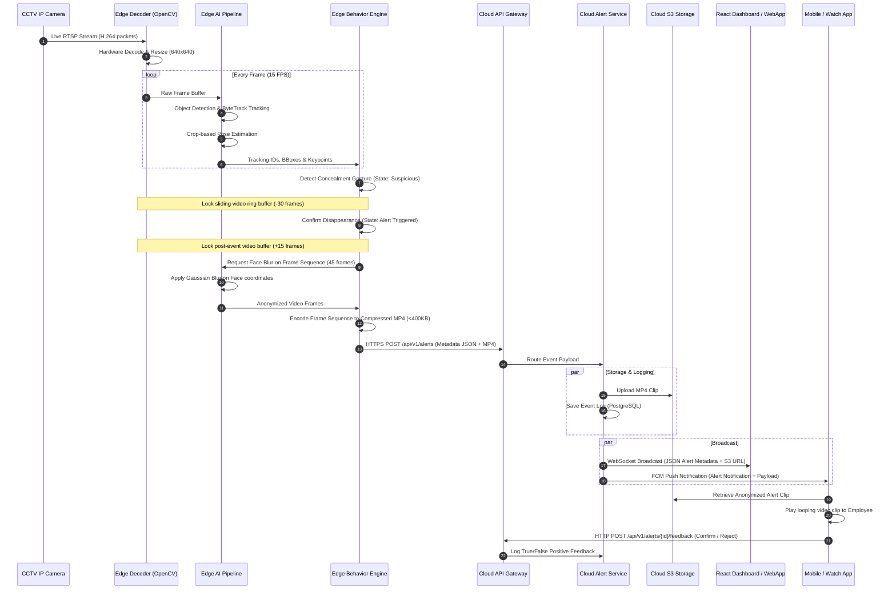

# Data Flow Diagram - Phase 2 Design Review

This document illustrates the end-to-end data transmission path, detailing how video frames are ingested, processed, and transformed into lightweight alerts routed to edge caches, cloud storage, and client applications.

---

## 1. End-to-End Sequence Diagram

The sequence below outlines frame processing, event triggers, face blurring, cloud ingestion, and real-time alert dispatch.

---

## 2. Data Flow Steps Description

### 2.1 Frame Ingestion & Buffer Queue
1. The IP camera streams raw H.264 packets continuously over the local network via RTSP.
2. The Edge Ingestion thread decodes the H.264 packets using GPU hardware acceleration. The frame is downscaled to $640\times640$ pixels and timestamped.

### 2.2 Edge AI Pipeline Processing
3. Every frame in the ingestion buffer is parsed by YOLOv11n to extract object bounding boxes.
4. Bounding boxes are tracked by ByteTrack, maintaining consistent customer tracking IDs.
5. If tracking IDs intersect with high-shrink regions or display interaction, pose estimation is executed to extract body skeleton joints.
6. The compiled metadata (tracking IDs, coordinates, joints, labels) is forwarded to the Behavior Engine.

### 2.3 Gesture Logic & Buffer Locking
7. The Behavior Engine analyzes spatial distance rules. When a wrist keypoint is close to a pocket/bag and the item vanishes, the state machine transitions to `Suspicious`.
8. The system locks the rolling RAM ring buffer to preserve the preceding 30 frames (2.0 seconds) of video.

### 2.4 Confirmation & Edge Anonymization
9. If the item does not reappear after 30 frames, the state transitions to `Alert Triggered`. The succeeding 15 frames are captured.
10. The pipeline utilizes the skeleton head keypoints to map a facial bounding box on all 45 frames. A Gaussian Blur is applied locally.
11. The anonymized frames are compressed using H.264/WebP encoding into a lightweight clip file (<400KB).

### 2.5 Cloud Ingestion & Dispatch
12. The edge node sends the alert package (metadata JSON and binary video clip) to the Cloud API Gateway via HTTPS.
13. The API Gateway forwards the request to the Alert Service.
14. The Alert Service uploads the video file to an Amazon S3 bucket and records the transaction in the PostgreSQL database.
15. The Alert Service broadcasts the event payload over active WebSocket channels to the web dashboard and pushes an FCM notification to active android/iOS devices.

### 2.6 Feedback Loop
16. The store associate opens the notification, retrieves the S3 video URL, and reviews the looping clip.
17. The associate submits feedback ("True Shoplifting", "False Alarm", "Theft Prevented"), which is logged in the database to optimize model thresholds.
