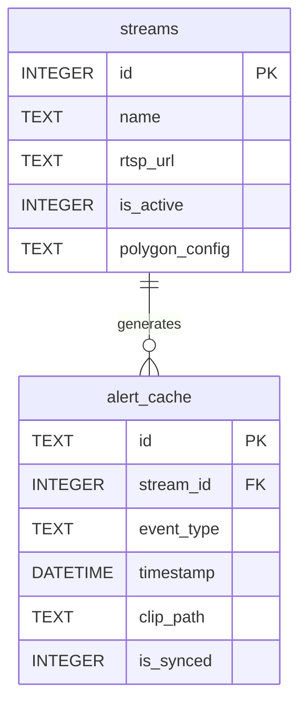
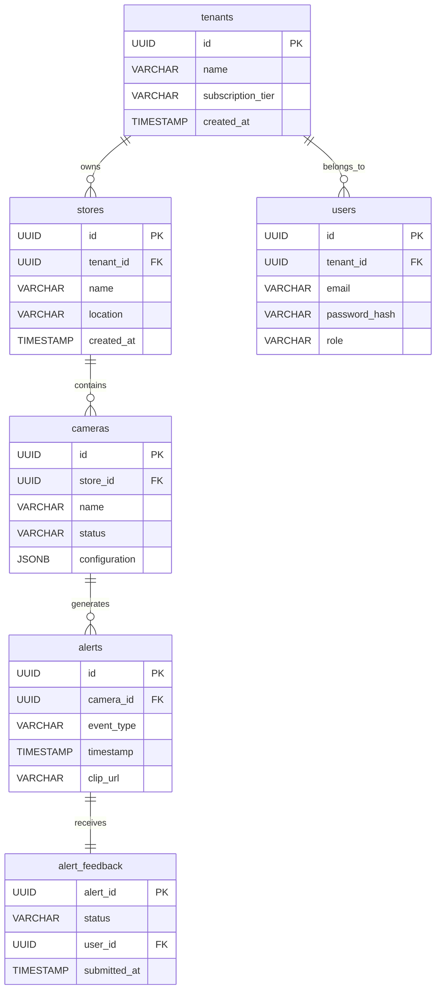

# Database Schema Design - Phase 2 Design Review

This document defines the database schemas for the local Edge NVR Node (SQLite) and the Cloud Control Plane (PostgreSQL).

---

## 1. Edge Node Local Schema (SQLite)

The edge gateway uses a local SQLite database (`/data/edge_cache.db`) to store temporary configurations, manage local camera streams, and cache alerts during internet outages.



### 1.1 Local Table DDL

```sql
-- Camera streams configured on the local Edge Node
CREATE TABLE streams (
    id INTEGER PRIMARY KEY AUTOINCREMENT,
    name TEXT NOT NULL,
    rtsp_url TEXT NOT NULL UNIQUE,
    is_active INTEGER DEFAULT 1 CHECK (is_active IN (0, 1)),
    polygon_config TEXT DEFAULT NULL -- JSON array defining detection polygons
);

-- Offline alert cache, queued for cloud synchronization
CREATE TABLE alert_cache (
    id TEXT PRIMARY KEY, -- UUIDv4
    stream_id INTEGER NOT NULL,
    event_type TEXT NOT NULL,
    timestamp DATETIME DEFAULT CURRENT_TIMESTAMP,
    clip_path TEXT NOT NULL, -- Path to local media file (/data/clips/alert_uuid.mp4)
    is_synced INTEGER DEFAULT 0 CHECK (is_synced IN (0, 1)),
    FOREIGN KEY (stream_id) REFERENCES streams(id) ON DELETE CASCADE
);

CREATE INDEX idx_alert_unsynced ON alert_cache(is_synced) WHERE is_synced = 0;
```

---

## 2. Cloud Platform Multi-Tenant Schema (PostgreSQL)

The cloud backend uses a multi-tenant PostgreSQL database. All tables are partitioned or referenced using a tenant ID to guarantee isolation between different retail clients.



### 2.1 Cloud Table DDL

```sql
-- Tenants (Retail companies)
CREATE TABLE tenants (
    id UUID PRIMARY KEY DEFAULT gen_random_uuid(),
    name VARCHAR(255) NOT NULL,
    subscription_tier VARCHAR(50) NOT NULL CHECK (subscription_tier IN ('Starter', 'Growth', 'Professional', 'Enterprise')),
    created_at TIMESTAMP WITH TIME ZONE DEFAULT CURRENT_TIMESTAMP
);

-- Retail Store Locations
CREATE TABLE stores (
    id UUID PRIMARY KEY DEFAULT gen_random_uuid(),
    tenant_id UUID NOT NULL REFERENCES tenants(id) ON DELETE CASCADE,
    name VARCHAR(255) NOT NULL,
    location VARCHAR(255),
    created_at TIMESTAMP WITH TIME ZONE DEFAULT CURRENT_TIMESTAMP
);

CREATE INDEX idx_stores_tenant ON stores(tenant_id);

-- User Accounts (Role-Based Access Control)
CREATE TABLE users (
    id UUID PRIMARY KEY DEFAULT gen_random_uuid(),
    tenant_id UUID NOT NULL REFERENCES tenants(id) ON DELETE CASCADE,
    email VARCHAR(255) UNIQUE NOT NULL,
    password_hash VARCHAR(255) NOT NULL,
    role VARCHAR(50) NOT NULL CHECK (role IN ('Owner', 'Manager', 'Associate')),
    created_at TIMESTAMP WITH TIME ZONE DEFAULT CURRENT_TIMESTAMP
);

CREATE INDEX idx_users_tenant ON users(tenant_id);

-- Camera Config Registry (Cloud representation of Edge streams)
CREATE TABLE cameras (
    id UUID PRIMARY KEY DEFAULT gen_random_uuid(),
    store_id UUID NOT NULL REFERENCES stores(id) ON DELETE CASCADE,
    name VARCHAR(255) NOT NULL,
    status VARCHAR(50) DEFAULT 'Offline' CHECK (status IN ('Online', 'Offline', 'Error')),
    configuration JSONB DEFAULT '{}'::jsonb, -- Store-level detection parameters, crop regions
    updated_at TIMESTAMP WITH TIME ZONE DEFAULT CURRENT_TIMESTAMP
);

CREATE INDEX idx_cameras_store ON cameras(store_id);

-- Alert Log
CREATE TABLE alerts (
    id UUID PRIMARY KEY DEFAULT gen_random_uuid(),
    camera_id UUID NOT NULL REFERENCES cameras(id) ON DELETE CASCADE,
    event_type VARCHAR(100) NOT NULL CHECK (event_type IN ('Pocket Concealment', 'Bag Concealment', 'Loitering', 'Restricted Intrusion')),
    timestamp TIMESTAMP WITH TIME ZONE NOT NULL,
    clip_url VARCHAR(512), -- URL pointing to AWS S3 bucket
    created_at TIMESTAMP WITH TIME ZONE DEFAULT CURRENT_TIMESTAMP
);

CREATE INDEX idx_alerts_camera ON alerts(camera_id);
CREATE INDEX idx_alerts_timestamp ON alerts(timestamp DESC);

-- Feedback loop for active model reinforcement
CREATE TABLE alert_feedback (
    alert_id UUID PRIMARY KEY REFERENCES alerts(id) ON DELETE CASCADE,
    status VARCHAR(50) NOT NULL CHECK (status IN ('True Positive', 'False Positive', 'Prevented')),
    user_id UUID NOT NULL REFERENCES users(id),
    submitted_at TIMESTAMP WITH TIME ZONE DEFAULT CURRENT_TIMESTAMP
);
```
