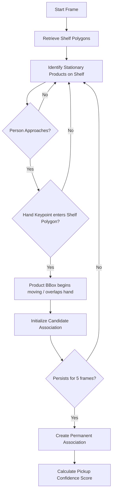
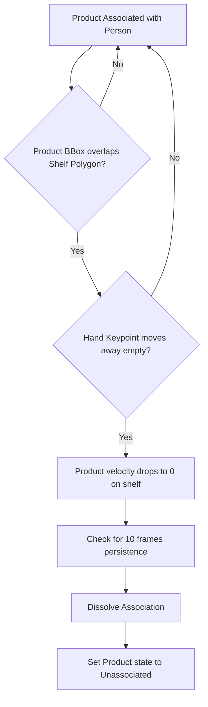
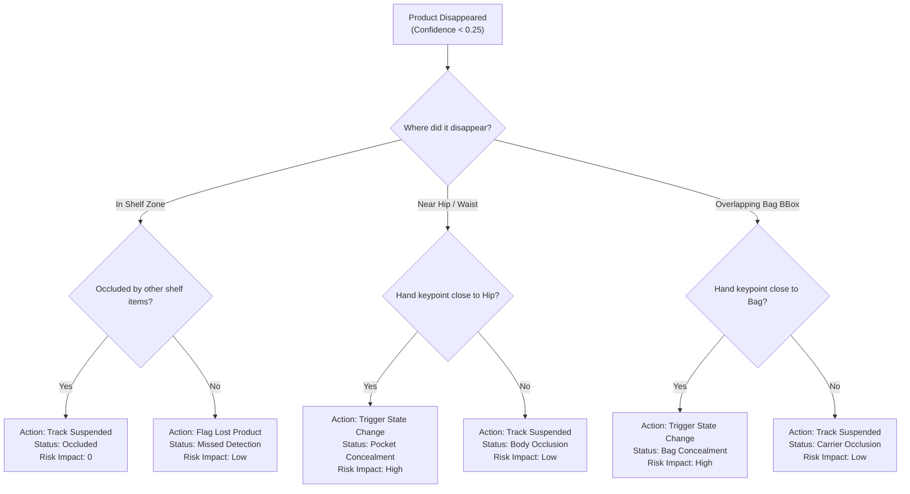
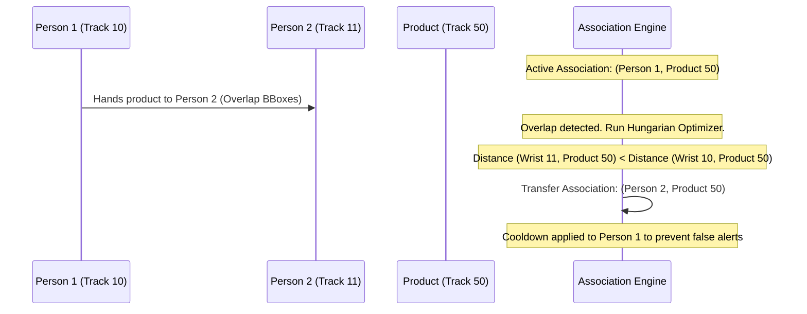

# Object Association Engine — Architecture Design Document

**Document Type**: Technical Specification and Implementation Blueprint  
**Classification**: Phase 2 System Design Reference  
**Audience**: Computer Vision Engineers, Pipeline Developers  

---

## 1. Responsibilities

The **Object Association Engine** serves as the relational compiler of the Retail AI Surveillance Platform. It is responsible for bridging the gap between raw object tracks and semantic human actions.

### 1.1 Core Responsibilities
1. **Semantic Linkage**: Establish and maintain a spatial-temporal link between a specific customer track (`Person_ID`) and the product tracks (`Product_ID`) or carrying containers (`Bag_ID`) they interact with.
2. **State Transition Tracking**: Detect when a product changes state from "on shelf" to "in possession" (pickup), "returned to shelf" (return), or "concealed/occluded" (disappearance).
3. **Multi-Entity Ownership Resolution**: Handle cases where multiple customers are in close proximity to the same item, resolving conflicts, handovers, and shared space interactions.
4. **Active Pose Allocation**: Signal the edge controller to activate/deactivate the crop-based pose estimation pipeline for a specific customer based on proximity and pickup events.

### 1.2 Out of Scope (What It Must Never Do)
1. **Object Classification**: It must never perform raw pixel-level detection; it operates solely on bounding boxes and class labels from YOLO11s.
2. **Visual Re-identification (Re-ID)**: It does not compute deep appearance embeddings. If a track is lost, Re-ID is the tracker's or the database's responsibility.
3. **Alert Generation**: It does not make security decisions or calculate company risk policies; it only exposes the state of associations and their confidence values to the downstream Behavior and Risk Engines.

---

## 2. Inputs

The Object Association Engine ingests structured metadata on every frame step.

| Input | Data Structure | Why It Is Needed |
| :--- | :--- | :--- |
| **Person Tracks** | List of `{track_id, bbox, confidence, velocity}` | Identify active customers in the scene and establish candidate association centroids. |
| **Object Detections** | List of `{track_id, bbox, class_label, confidence}` | Differentiate products (`shelf_item`), baskets (`store_basket`), and personal bags (`backpack`, `handbag`). |
| **Track IDs** | `int` | Ensure consistency of entities over time. Association keys are built on `(person_track_id, object_track_id)`. |
| **Bounding Boxes** | `[x_min, y_min, x_max, y_max]` (Normalized $[0.0, 1.0]$) | Spatial calculations for Intersection over Union (IoU), distance vectors, and containment checking. |
| **Pose Keypoints** (Optional) | Array of 17 keypoints: `{joint_id: (x, y, conf)}` | Run hand-proximity calculations when a customer enters the `INTERACTING` state. |
| **Frame Timestamps** | `float` (Epoch milliseconds) | Track velocities, build acceleration vectors, and calculate duration thresholds. |
| **Shelf Regions** | List of `polygon_coordinates` | Map spatial boundaries of stationary inventory zones to verify if an item is "on shelf" or "removed". |
| **Store Map** | `{exit_zones: polygons[], registers: polygons[]}` | Detect coordinate paths crossing exits or registers to resolve theft vs. purchase intent. |
| **Detection Confidence** | `float [0.0, 1.0]` | Filter low-quality predictions to prevent false association initialization. |

---

## 3. Association Strategies

We evaluate several spatial and temporal matching strategies:

| Strategy | Pros | Cons | Selection / Rationale |
| :--- | :--- | :--- | :--- |
| **Nearest Distance** | Computational cost is $\mathcal{O}(N \times M)$ where $N$ is persons and $M$ is objects. | Fails in crowded aisles; associates items with customers simply standing nearby. | Rejected as a primary strategy; used as a weak fallback. |
| **Intersection over Union (IoU)** | Detects direct physical overlap between product and person bounding boxes. | When a person stands in front of a product, IoU overlaps without actual contact. | **Selected (Tier 1 Baseline)**. High robustness for initial proximity checks. |
| **Hand-to-Object (Pose Keypoints)** | Highest semantic accuracy; verifies actual physical grabbing gesture. | Demands pose estimation execution, which increases VRAM/GPU load. | **Selected (Tier 2 Upgrade)**. Only run when a person is in `Candidate` state. |
| **Velocity Correlation** | Identifies items moving in identical trajectories as a person (e.g. holding an item). | Fails when a customer is stationary or moving very slowly. | **Selected (Motion Verification)**. Confirms an item is in active possession. |
| **Temporal Consistency** | Eliminates single-frame noise and false detections. | Introduces a slight latency delay (e.g. 5 frames $\approx 330\text{ms}$). | **Selected (Required Filter)**. No association is confirmed without $N$-frame persistence. |
| **Graph Matching (GNNs)** | Models global structural relationships across the entire store scene. | Extremely compute-heavy; hard to run in real-time on edge hardware. | Rejected for MVP; reserved for future cloud-based post-analysis. |
| **Hungarian Matching** | Solves the linear sum assignment problem globally per frame. | Fails to handle temporal birth/death of multi-frame trajectories well on its own. | **Selected (Global Optimizer)**. Resolves conflicting associations in dense crowds. |

### 3.1 Selected MVP Hybrid Strategy: Hierarchical Kalman-Hungarian Assignment

For the MVP, we deploy a **two-tier spatial-temporal association pipeline**:
1. **Tier 1 (Proximity Filtering)**: Filter candidate associations using bounding box intersections and 2D centroid distances. 
2. **Tier 2 (Grasp Verification)**: If a candidate association persists for $\geq 5$ frames, the engine requests pose estimation for that person. The system computes the Euclidean distance between the hand keypoints (`left_wrist`, `right_wrist`) and the product bbox center.
3. **Hungarian Optimization**: Run the Hungarian algorithm globally on the distance matrix of active hands and active products. This prevents a single product from being associated with multiple hands in crowded conditions.

---

## 4. Association Lifecycle

Associations are modeled as state machines tracking the relationship of a `(Person_ID, Object_ID)` pair.

```mermaid
stateDiagram-v2
    [*] --> Unassociated : Product detected on shelf
    Unassociated --> Candidate : Person-Object IoU > 0.05
    Candidate --> Unassociated : IoU drops to 0 before threshold
    Candidate --> Associated : Persists for 5 frames AND Wrist-to-Object < 0.08
    Associated --> Weak : Product detection confidence drops (< 0.25)
    Weak --> Associated : Product re-detected near hand within 30 frames
    Weak --> Lost : Product missing for > 30 frames
    Lost --> Expired : Product fails to reappear; check disappearance location
    Lost --> Associated : Product re-detected on path of same Person_ID
    Associated --> Unassociated : Product returned to shelf region
```

### 4.1 Transition Rules
* **Unassociated $\to$ Candidate**: Centroid distance $d(C_{person}, C_{product}) < \theta_{prox}$ OR $\text{IoU}(B_{person}, B_{product}) > 0.05$.
* **Candidate $\to$ Associated**: Person-product overlap persists for 5 consecutive frames AND the Hungarian matching optimizer successfully assigns the product to the person's hand keypoint.
* **Associated $\to$ Weak**: The product's YOLO detection confidence drops below $0.25$ (occluded by body, pocket, or bag).
* **Weak $\to$ Lost**: The product remains undetected for $> 30$ frames (2 seconds).
* **Lost $\to$ Expired**: The track is terminated, and the disappearance is categorized by the Disappearance Decision Tree (Section 7).

---

## 5. Product Pickup Detection

Pickup detection monitors the transition of a product from a stationary state on a shelf to an active association state.

### 5.1 Pickup Confidence Calculation
The confidence of a pickup event $C_{pickup}$ is a weighted function of detection accuracy, spatial proximity, and movement continuity:
$$C_{pickup} = w_1 \cdot \text{Conf}_{YOLO} + w_2 \cdot (1 - d_{hand \to product}) + w_3 \cdot \text{Score}_{motion}$$
Where:
* $w_1 = 0.3$, $w_2 = 0.4$, $w_3 = 0.3$.
* $d_{hand \to product}$: Normalized distance between wrist keypoint and product bbox center.
* $\text{Score}_{motion}$: Cosine similarity of the product's velocity vector and the hand's velocity vector over 5 frames.

---

## 6. Product Return Detection

Return detection tracks whether a customer places an item back onto a shelf, terminating the active association.

### 6.1 Return Logic Rules
1. **Spatial Constraint**: The product bounding box must enter a configured `shelf_polygon` region.
2. **Separation Event**: The distance between the customer's wrist keypoint and the product bbox center must exceed $\theta_{grab}$ ($0.08$ normalized coordinates) while the product remains stationary.
3. **Track Dissolution**: Once separation persists for 10 frames, the association is removed. If the product is subsequently picked up by a different customer, a new association lifecycle begins.

---

## 7. Product Disappearance

When a previously tracked product disappears from the view of the object detector, the engine must diagnose the cause using a **Disappearance Decision Tree**:

---

## 8. Pocket and Backpack Association

Associating a product disappearance with a pocket or bag is the most challenging task in the pipeline due to rapid occlusion and hand-eye coordinate overlap.

### 8.1 Constraints & Rules
* **Spatial constraints**:
  - **Pocket Area**: Defined dynamically as a bounding box centered around the midpoint of the hip keypoints ($k_{11}, k_{12}$), extending down to mid-thigh level:
    $$B_{pocket} = [x_{mid} - 0.1w, y_{hip}, x_{mid} + 0.1w, y_{hip} + 0.15h]$$
    where $w$ and $h$ are the width and height of the person's bounding box.
  - **Bag Area**: Defined by the tracked bounding box of the backpack/handbag.
* **Temporal constraints**: The disappearance of the product must occur within $\pm10$ frames of the hand keypoint entering the spatial pocket/bag zone.
* **Motion constraints**: Before disappearing, the product's velocity vector must point towards the pocket/bag centroid.
* **Confidence Fusion Model**:
  $$\text{Conf}_{concealment} = \text{Conf}_{pickup} \times \text{Overlap}(B_{item}, B_{pocket/bag}) \times \text{Proximity}(k_{wrist}, k_{hip/bag})$$

---

## 9. Multiple Person Interaction

In crowded environments, multiple customers may stand near the same shelf space or interact with each other.

### 9.1 Conflict Resolution Logic
* **Passing / Handovers**: When Person 1 transfers an item to Person 2, the bounding boxes of Person 1, Person 2, and the item will overlap. The engine runs a continuous Hungarian matching step on the hand keypoints of both tracks. When the item is closer to the hand of Person 2 for $>10$ consecutive frames, the association is transferred.
* **Shared Ownership**: If two people hold a large item (e.g. a large box), the Hungarian algorithm will split, assigning the item to the person with the higher track age. A "shared track" flag is appended to prevent false alarm triggers.
* **Symmetry Check**: If a person-product association change is detected, a 1-second validation lock is applied. No concealment alerts can be generated during this handover lock.

---

## 10. Confidence Model

The system outputs a continuous association confidence score $S_{assoc} \in [0.0, 1.0]$.

### 10.1 Weighted Confidence Formula
$$S_{assoc} = w_{dist} \cdot S_{dist} + w_{motion} \cdot S_{motion} + w_{temp} \cdot S_{temp} + w_{pose} \cdot S_{pose}$$

* **Distance Score ($S_{dist}$)**: Inversely proportional to Euclidean distance between hand keypoint and product center:
  $$S_{dist} = 1.0 - \min\left(1.0, \frac{d(k_{wrist}, C_{product})}{\theta_{prox}}\right)$$
* **Motion Score ($S_{motion}$)**: Directional cosine similarity of hand and product velocity vectors:
  $$S_{motion} = \max\left(0.0, \frac{\vec{v}_{hand} \cdot \vec{v}_{product}}{\|\vec{v}_{hand}\| \|\vec{v}_{product}\|}\right)$$
* **Temporal Score ($S_{temp}$)**: Tracking consistency over a sliding window of size $N = 15$ frames:
  $$S_{temp} = \frac{\text{Frames Detected}}{\text{Total Window Frames}}$$
* **Pose Score ($S_{pose}$)**: The average detection confidence of the wrist, hip, and shoulder keypoints from YOLO11-Pose.

### 10.2 Weight Allocation Matrix

| Scenario | $w_{dist}$ | $w_{motion}$ | $w_{temp}$ | $w_{pose}$ | Rationale |
| :--- | :--- | :--- | :--- | :--- | :--- |
| **No Pose (General)** | 0.50 | 0.20 | 0.30 | 0.00 | Relies on centroid distances and IoU. |
| **Active Interaction** | 0.30 | 0.20 | 0.20 | 0.30 | Prioritizes hand keypoint tracking accuracy. |
| **Disappearance** | 0.20 | 0.10 | 0.40 | 0.30 | Relies heavily on temporal consistency and last pose positions. |

---

## 11. Failure Cases and Mitigations

| Failure Case | Impact | Mitigation Strategy |
| :--- | :--- | :--- |
| **Occlusion** | Bounding box disappears behind another customer. | Kalman state prediction: continue tracking the virtual bounding box trajectory based on historical velocity. |
| **Crowded Scenes** | BBoxes merge; Hungarian optimizer yields high error rates. | Mask association analysis in designated zones where density $> 3\text{ people/m}^2$. |
| **Tracking Switches** | Customer ID changes, breaking the association chain. | Soft-reassociation: if a new Person ID appears within 1.5 meters of a lost Person ID with similar velocity and carrying states, merge histories. |
| **Product Similarity** | Multiple identical boxes on a shelf are swapped by the tracker. | Maintain associations based on local relative positions rather than absolute track IDs for identical product classes. |
| **Tiny Objects** | Lipsticks or cosmetics are hidden by the hand itself immediately upon pickup. | Hand-to-shelf intersection trigger: if a hand keypoint enters a shelf zone and leaves closed (estimated from bounding box contraction), initialize a "hidden item" dummy association. |

---

## 12. Future Extensions

To scale beyond the limits of passive monocular CCTV, the Association Engine is structured to support multi-sensor inputs:

* **RFID & IoT Integration**: Correlate RFID sensor triggers at exit gates with active Person IDs approaching the exit. If an RFID alarm fires and Person 10 is the only track in the exit zone, associate the stolen SKU directly with Person 10.
* **Shelf Sensors**: Weight-based shelf sensors send API events when an item is removed. The engine uses the timestamp to match the removal event with the closest candidate Person ID.
* **3D Pose and Depth Cameras**: Incorporate depth ($Z$-axis) coordinates to resolve 3D hand-to-shelf proximity, eliminating projection errors from 2D camera perspectives.
* **Multi-Camera Association**: Re-associate Person IDs and their associated carrying gear across camera handovers using spatial overlapping zones and color histogram matching.
