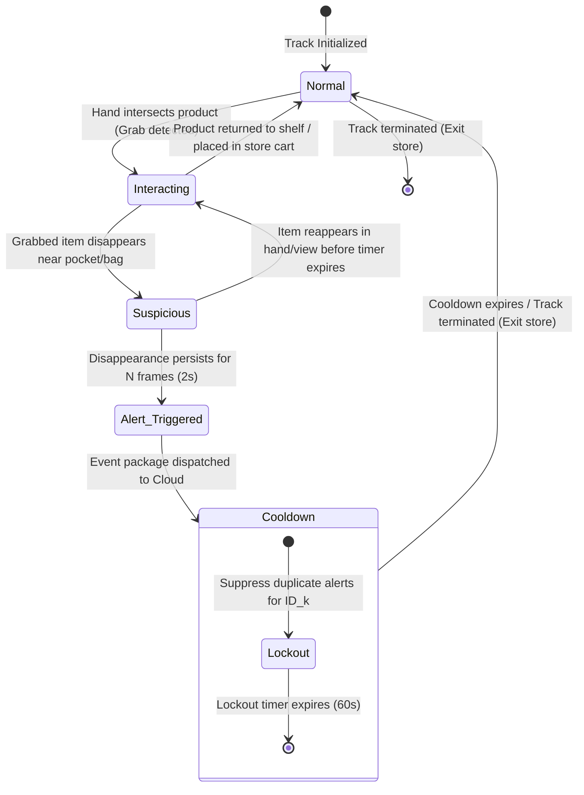

# State Machine Design - Phase 2 Design Review

This document defines the lifecycle states and transitions of a tracked customer, detailing how suspicious behavior is evaluated, confirmed, and routed while avoiding duplicate alerts.

---

## 1. Tracking State Diagram

The Behavior Engine maintains a state machine for each active tracking ID ($ID_k$).

---

## 2. State Definitions

### 2.1 Normal State
* **Description**: The baseline state of a customer. The customer is walking through aisles, inspecting shelves without active product retention, or pushing a shopping cart.
* **Inference Load**: Full-frame object detection + tracking. Pose keypoint estimation is run at low resolution or skipped to save GPU power until an interaction is detected.

### 2.2 Interacting State
* **Description**: The customer has retrieved an item from the shelf. The system has registered an active hold on a product ID.
* **Transition Trigger**: A hand (`wrist` keypoint) intersects a shelf product bounding box.
* **Action**:
  - Store the product's classification and bounding box coordinates in the customer's short-term history.
  - Elevate pose estimation priority to track wrist-to-hip and wrist-to-bag distances at full frame rate.

### 2.3 Suspicious State
* **Description**: The held product has disappeared from camera view while in proximity to a pocket, jacket interior, or personal bag.
* **Transition Trigger**: The product bounding box vanishes, and the wrist keypoint is within a threshold distance ($\theta_{pocket}$ or $\theta_{bag}$) of a pocket or personal bag.
* **Action**:
  - Initialize a frame counter timer ($C_{frames} = 0$).
  - Lock the current rolling video buffer segment (15 frames prior to this moment).

### 2.4 Alert Triggered State
* **Description**: The disappearance is verified, and a theft event is confirmed.
* **Transition Trigger**: The frame counter $C_{frames}$ reaches $N_{confirm} = 30$ frames (2 seconds at 15 FPS) without the product reappearing in clear view or being returned.
* **Action**:
  - Freeze the video buffer capture (30 frames post-event).
  - Blur all faces in the 45-frame sequence.
  - Encode the video clip and post the alert package.

### 2.5 Cooldown & Lockout State
* **Description**: A temporary safety state to prevent spamming notifications.
* **Transition Trigger**: Immediate post-alert generation.
* **Mechanism**:
  - The tracking ID $ID_k$ is placed on a lockout list.
  - While on lockout, additional suspicious behaviors by $ID_k$ are recorded locally in database logs for auditing, but **no new mobile push alerts** are generated.
  - The lockout lasts for 60 seconds or until the track is lost (when the customer leaves the field of view).

---

## 3. Transition Rules & Event Actions

| Current State | Target State | Trigger Condition | Event Action |
| :--- | :--- | :--- | :--- |
| **Normal** | **Interacting** | Wrist keypoint $w_j$ intersects $B_{item}$ | Register `held_item_id`, flag hand as occupied. |
| **Interacting** | **Normal** | Bounding box $B_{item}$ overlaps shelf area AND wrist moves away empty | Unregister `held_item_id`, release hand occupied flag. |
| **Interacting** | **Suspicious** | `held_item_id` loses detection confidence (< 0.20) AND distance $d(wrist, hip) < \theta_{pocket}$ | Lock past video buffer frames, start disappearance counter. |
| **Suspicious** | **Interacting** | Bounding box matching `held_item_id` reappears in hand/clear view | Reset disappearance counter, release video buffer locks. |
| **Suspicious** | **Alert Triggered**| Disappearance counter reaches 30 frames (2s) | Trigger face blur, encode 45-frame clip, POST to Cloud. |
| **Alert Triggered**| **Cooldown** | Alert package successfully compiled | Add `track_id` to lockout map, start 60s timer. |
| **Cooldown** | **Normal** | Lockout timer expires | Remove `track_id` from lockout map. |
