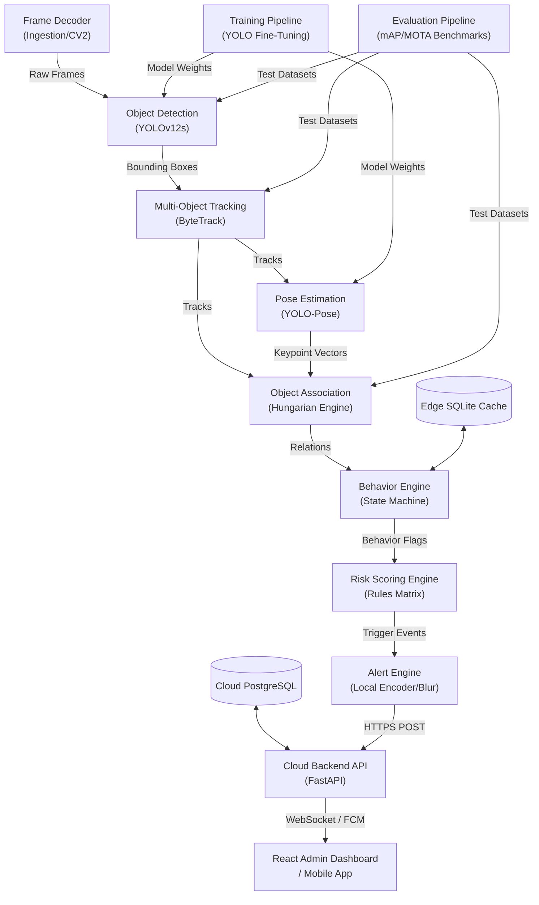

# Module Dependencies - Phase 3 Production Planning

**Document Type**: Architectural Dependency Analysis  
**Classification**: Implementation Sequencing Reference  
**Audience**: DevOps Engineers, System Integrators, QA Engineers  

This document defines the structural dependencies between the system modules, specifying the order of development to minimize integration risks and prevent architectural blockages.

---

## 1. Architectural Dependency Graph

Below is the dependency graph mapping the flow of implementation. Modules at the top must be completed and tested before downstream modules can be built.

---

## 2. Integration Risk Minimization Rationale

To reduce refactoring and enable continuous integration, we follow a **strict bottom-up data processing order** (base decoder up to client dashboard):

1. **Decoder First**: Video ingestion is the data source of the entire system. Implementing the decoder first guarantees that all downstream modules have a stable, non-leaking H.264 stream to consume from the beginning.
2. **Decoupling AI from Logic**: Bounding box tracking (ByteTrack) and pose coordinates (YOLO-Pose) represent the structural interface for the logical reasoning layer. By establishing this interface early, we can develop and unit-test the Association and Behavior engines using mock coordinate JSON files, even before the YOLO models are fully trained or optimized.
3. **Decoupled Edge and Cloud**: The Alert Engine boundary defines the hand-off from edge to cloud. Once the local Edge SQLite database and the alert poster are established, the Edge team can run simulations and test the local pipeline end-to-end without waiting for the Cloud team to complete the full multi-tenant cloud API. The Cloud team, in turn, can develop the API using mocked Edge payload posts.
4. **Dashboard Last**: The presentation layer is purely consumer-driven. Developing it last prevents design churn, ensuring the React canvas drawer maps to actual PostgreSQL polygon coordinates and APIs that have already been verified.
